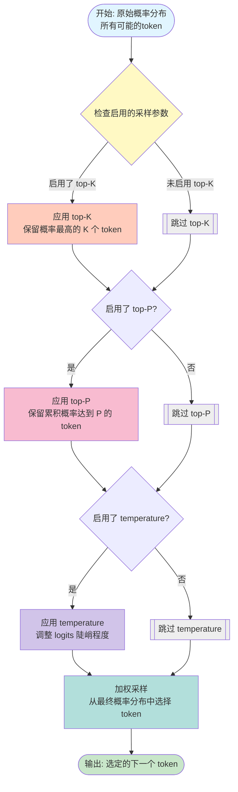

# 提示工程

作者:Lee Boonstra
2025 年 2 月

---

## 目录

- 引言 6
- 提示工程 7
- LLM 输出配置 8
  - 输出长度 8
  - 采样控制 9
  - 温度(Temperature) 9
  - Top-K 和 Top-P 10
  - 综合运用 11
- 提示技术 13
  - 通用提示/零样本 13
  - 单样本和少样本 15
  - 系统提示、上下文提示和角色提示 18
  - 系统提示 19
  - 角色提示 21
  - 上下文提示 23
  - 后退提示 25
  - 思维链(CoT) 29
  - 自我一致性 32
  - 思维树(ToT) 36
  - ReAct(推理与行动) 37
  - 自动提示工程 40
- 代码提示 42
  - 编写代码的提示 42
  - 解释代码的提示 44
  - 翻译代码的提示 46
  - 调试和审查代码的提示 48
- 多模态提示呢? 54
- 最佳实践 54
  - 提供示例 54
  - 简洁设计 55
  - 明确输出要求 56
  - 使用指令而非约束 56
  - 控制最大令牌长度 58
  - 在提示中使用变量 58
  - 尝试不同的输入格式和写作风格 59
  - 对于少样本分类任务,混合使用不同类别 59
  - 适应模型更新 60
  - 尝试不同的输出格式 60
  - JSON 修复 61
  - 使用模式(Schemas) 62
  - 与其他提示工程师协作实验 63
  - CoT 最佳实践 64
  - 记录各种提示尝试 64
- 总结 66
- 尾注 68

---

## 引言

> 你不需要成为数据科学家或机器学习工程师，每个人都可以编写提示。

当我们思考大型语言模型的输入与输出时，文本提示（有时会伴随图像等其他模态）就是模型用来预测特定输出的输入形式。你并不需要成为数据科学家或机器学习工程师——任何人都可以编写提示词。然而，要打造最有效的提示词却可能十分复杂。提示词的效果受到许多因素的影响：所使用的模型、模型的训练数据、模型的配置、你的用词选择、写作风格与语气、结构以及上下文等都非常重要。因此，提示词工程是一个反复迭代的过程。不够完善的提示可能会导致含糊不清或不准确的回答，甚至会妨碍模型提供有意义的输出。

当你与 Gemini 聊天机器人互动时，实际上你就在编写提示词。然而，本白皮书重点讨论的是如何在 Vertex AI 中，或通过 API 对 Gemini 模型进行提示词编写，因为在直接向模型发送提示词时，你可以配置诸如 temperature（温度）等参数。

本白皮书将详细讨论提示词工程。我们将介绍各种提示技巧，帮助你入门，并分享经验与最佳实践，帮助你成为提示词专家。我们还会讨论在编写提示词过程中可能遇到的挑战。

---

### 提示工程的本质

请记住，大语言模型（LLM）的工作原理：它是一个预测引擎。模型接收一段顺序文本作为输入，然后根据其训练数据预测接下来的 token（标记）应该是什么。LLM 通过不断重复这个过程来运行：将先前预测出的 token 添加到文本末尾，再基于新的完整上下文预测下一个 token。下一步的预测依赖于之前 token 中的内容，以及模型在训练过程中见过的模式。

当你编写一个提示词（prompt）时，你的目标是设置输入，使 LLM 更可能预测出正确的 token 序列。提示工程是设计高质量提示词以引导 LLM 产生准确输出的过程。这个过程包括尝试找到最佳提示词、优化提示长度、以及从写作风格和结构上改进提示词，使其更适合当前任务。

在自然语言处理和大语言模型的语境中，“prompt” 是提供给模型的输入，用于让它生成响应或执行预测。

这些提示词可用于完成多种理解与生成任务，例如：文本摘要、信息抽取、问答、文本分类、语言或代码翻译、代码生成、代码文档生成或推理任务。

你可以参考 Google 的提示工程指南 ²³，其中包含简单有效的提示示例。

在进行提示工程时，第一步是选择模型。无论你使用的是 Vertex AI 中的 Gemini 模型、GPT、Claude，还是开源模型（如 Gemma 或 LLaMA），提示词都可能需要针对特定模型进行优化。

除了提示词本身之外，你还需要调整 LLM 的多种配置参数。

---

## LLM 输出配置

当你选定模型之后，你需要配置模型参数。大多数 LLM 都带有多种配置选项，用于控制模型的输出。要进行有效的提示工程，就需要为任务合理设置这些配置。

### 输出长度

一个重要的配置项是：生成的响应 token 数量。

生成更多 token 会让 LLM 需要更多计算，导致 更高的能耗、更慢的响应时间，以及更高的成本。

减少输出长度并不会让 LLM 自动写出风格更简洁的文本，它只是会在达到 token 限制后停止预测。如果你需要较短的输出，你可能必须在提示词中专门为此设计。

输出长度限制在某些 LLM 提示技巧中尤其重要，例如 ReAct，这种方法中 LLM 可能会在正确的输出之后继续生成无用的 token。

请注意：生成更多 token 需要更多计算，从而导致更高能耗、更慢响应时间与更高的成本。

### 采样控制

LLM 实际上并不会直接“预测一个 token”，它会预测“每个可能 token 的概率”，也就是为模型词表中的每个 token 分配一个概率。然后根据这些概率进行采样，从而产生最终的下一个 token。

控制这些采样过程的常见参数包括：

- _Temperature（温度）_

- _Top-K_

- _Top-P_

这些配置决定了如何从概率分布中选择具体 token。

#### 温度(Temperature)

Temperature 用于控制 token 选择时的随机性程度。

- **较低的温度：** 适用于需要确定性更强的响应。
- **较高的温度：** 适用于希望得到更多样化、更多创造性或更不可预测输出的任务。

当 temperature 设置为 0（贪婪解码）时，模型是确定性的：它总是选取概率最高的 token。（但如果两个 token 的最高概率完全相同，具体输出可能取决于模型如何处理“并列”。）

接近最大值的温度会让输出变得更加随机；随着温度进一步提高，所有 token 的概率趋于接近，几乎同样可能被选中。

这种高温设定特别适用于那些对精确性要求不高、愿意探索创意输出的场景。

Gemini 模型的 temperature 控制可以类似理解为机器学习中的 _softmax 温度（T）_：

- **低 temperature** → 类似 softmax 低温：模型更“确定”，只偏好高概率 token。
- **高 temperature** → 类似 softmax 高温：更多 token 会被纳入选择范围，不确定性增加。

#### Top-K 和 Top-P

Top-K 和 Top-P（也称为 nucleus sampling，核采样）是 LLM 中常用的两种采样设置，用于将“下一个 token 的候选范围”限制在模型预测概率最高的一部分 token 中。

与 temperature 类似，这些采样方法用于控制生成文本的 随机性 和 多样性 。

**Top-K 采样**
Top-K 采样会从模型预测的分布中选择 概率最高的 K 个 token 作为候选集合。

- **更高的 K** → 输出更具创造性与多样性
- **更低的 K** → 输出更保守、更趋向事实
- **Top-K = 1** → 等同于贪婪解码（每次只选最可能的 token）

**Top-P 采样**
Top-P（核采样）会从概率分布中选取 累计概率不超过 P 的 token 集合。

- **P = 0** → 等同于贪婪解码
- **P = 1** → 所有词表中的 token 都有可能被采样

Top-P 的优势在于候选 token 的数量根据实际概率分布动态变化，而不像 Top-K 固定数量。

### 综合运用

在选择 top-K、top-P、temperature（温度）和生成 token 数量时，最佳设置取决于具体应用场景和期望的输出效果。这些设置之间相互影响，因此了解你所使用的模型如何组合这些采样配置非常重要。

如果同时提供 temperature、top-K 和 top-P 参数设置（如在 Vertex Studio 中），则：

- 符合 top-K 和 top-P 条件的 token 会形成候选集合
- 然后模型会对这些候选 token 应用 temperature 来采样生成下一个 token

如果没有 temperature 设置，则从满足 top-K 和 top-P 条件的 token 中随机选择下一个 token。

如果只提供 top-K 或 top-P 其中一种，则采用相同流程，只使用可用的那一项来筛选 token 范围。

#### 配置极端情况

在某个采样配置被设置到极端值时，它会让其他配置要么失效，要么变得无关紧要：

**Temperature（温度）极端值**

- temperature = 0 ：top-K 与 top-P 都失效，模型总是选择概率最高的 token
- temperature 极高（如 > 1，多为 10+）： temperature 本身会因随机性过大而变得无意义，模型会从通过 top-K/ top-P 筛选的 token 中随机采样。

**top-K 极端值**

- top-K = 1 ：temperature 和 top-P 全部失效，因为只有 1 个 token 通过筛选，下一个 token 就是它。
- top-K 极大（例如等于词表大小）：任何概率 > 0 的 token 都会通过，等于没有筛掉任何 token。

**top-P 极端值**

- top-P = 0（或非常接近 0）：大多数 LLM 的实现只会让“概率最高的 token”通过，top-K 的筛选和后续 temperature 的采样都将没有意义。
- top-P = 1 ：所有概率 > 0 的 token 都通过，无筛选效果，因为所有候选 token 的概率之和必然等于 1。

更高的自由度（更高 temperature、top-K、top-P、生成更多 token）会增加生成不相关内容的概率。

**警告：**
你可能见过一些回复结尾不断出现无意义重复内容，这就是 LLM 中常见的 “重复循环 bug”。模型会陷入循环，不断重复同一个词、短语或句式。
产生原因如下：

- 低温时（过度确定性）：模型会 rigidly 跟随最高概率路径，如果该路径回到之前的内容，就会形成循环。

- 高温时（过度随机性）：随机选择导致可能意外回到某个重复模式，形成无限循环。

不论高温或低温，采样过程都会“卡住”，一直生成无用内容直到输出长度用尽。

解决方法：需要调整 temperature、top-K、top-P，使随机性与确定性达到合适平衡。

**推荐起始设置表:**

| 场景                           | Temperature | Top-P  | Top-K  |
| ------------------------------ | ----------- | ------ | ------ |
| 平衡（连贯但适度创造           | 0.2         | 0.95   | 30     |
| 高度创造性                     | 0.9         | 0.99   | 40     |
| 减少创造性，更精确             | 0.1         | 0.9    | 20     |
| 有唯一答案（数学题、事实问答） | 0           | _任意_ | _任意_ |

_^表-1 推荐起始设置表_

**Token 筛选流程图：**

_^图-1 Token 筛选流程图_

---

## 提示技术

大语言模型（LLM）虽然经过大量数据训练，也被特别调优来理解用户指令，但它们并不是完美的。你的提示写得越清晰，模型越能准确地预测和生成你想要的内容。此外，如果你了解 LLM 的工作方式并善用一些专门的技巧，就能显著提升输出的质量与相关性。

现在我们已经理解了什么是提示工程以及其所需内容，让我们通过一些示例来了解最重要的提示技巧。

### 通用提示/零样本

零样例提示是最基础的一种提示方式。它只提供任务描述，没有示例，也没有参考格式。输入可以是任何形式：一个问题、一段故事的开头、一条任务指令等。零样例（zero-shot）的意思就是“没有案例示范”。

让我们使用 Vertex AI 中的 Vertex AI Studio（Language 部分），该工具提供一个用于测试提示的 playground。在下方的 `零样例提示示例表` 中，你将看到一个用于分类电影评论的零样例提示示例。

对于这种分类任务，我们通常会：

- 把 temperature 设置得较低（因为不需要创造力）
- 保持 gemini-pro 默认的 top-K 和 top-P（相当于关闭随机采样）

你会注意到，如果提示文本包含像 disturbing（令人不安）和 masterpiece（杰作）这样的混合词语，模型判断情绪倾向会更复杂一些，这正是零样例提示的挑战之一。

| 名称     | 1_1_movie_classification                                                                                                                                                                               |
| -------- | ------------------------------------------------------------------------------------------------------------------------------------------------------------------------------------------------------ |
| 目标     | 将电影评论分类为积极、中性或消极。                                                                                                                                                                     |
| 模型     | gemini-pro                                                                                                                                                                                             |
| 温度     | 0.1                                                                                                                                                                                                    |
| 令牌限制 | 5.0                                                                                                                                                                                                    |
| Top-K    | N/A                                                                                                                                                                                                    |
| Top-P    | 1                                                                                                                                                                                                      |
| 提示     | 将电影评论分类为积极(POSITIVE)、中性(NEUTRAL)或消极(NEGATIVE)。  评论:"Her"是一项令人不安的研究,揭示了如果允许 AI 不受控制地继续发展,人类将走向何方。我希望有更多像这样的杰作电影。  情感: |
| 输出     | POSITIVE(积极)                                                                                                                                                                                         |

_^表-2 零样例提示示例_

在文档中，我们通常会把提示整理成这种表格，记录不同版本的提示及其输出。因为提示往往要经过很多轮迭代才会进入代码库，所以用结构化的方式管理它们非常关键。本章后面“最佳实践”部分会专门介绍如何记录每次提示尝试。

当零样例提示效果不佳时，你可以在提示中加入“示范”或“案例”，这就形成了 "单样例（one-shot）" 或 "少量样例（few-shot）" 的提示方式。

### 单样例和少样例

在为 AI 模型设计提示时，提供示例往往非常有帮助。

这些示例能让模型更清晰地理解你想要的输出格式或模式，特别是在你希望模型严格模仿某种结构时，示例会显著提高稳定性与准确性。

- **单样例提示（One-shot）：** 只提供一个示例，模型会参考你提供的那一个示例，并尝试模仿示例的风格、结构和任务方式来完成你的要求。

- **少样例提示（Few-shot）：** 提供多个示例，更多示例能让模型更好地理解你希望它模仿的规律，提高输出的一致性与可靠性。

对于少样本提示，所需的示例数量取决于：任务复杂度、示例质量以及所使用的模型的能力。作为一般经验法则，至少使用 3 到 5 个示例效果比较稳妥。

但如果任务复杂度较高，可能需要更多；相反，如果模型有输入长度限制，则只能提供更少的示例。
