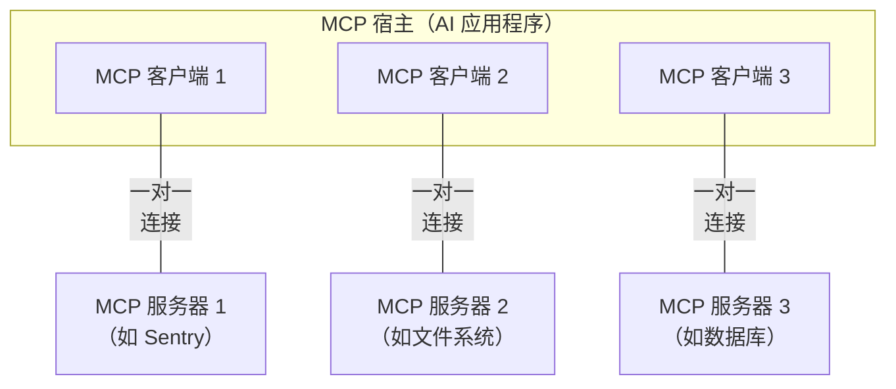
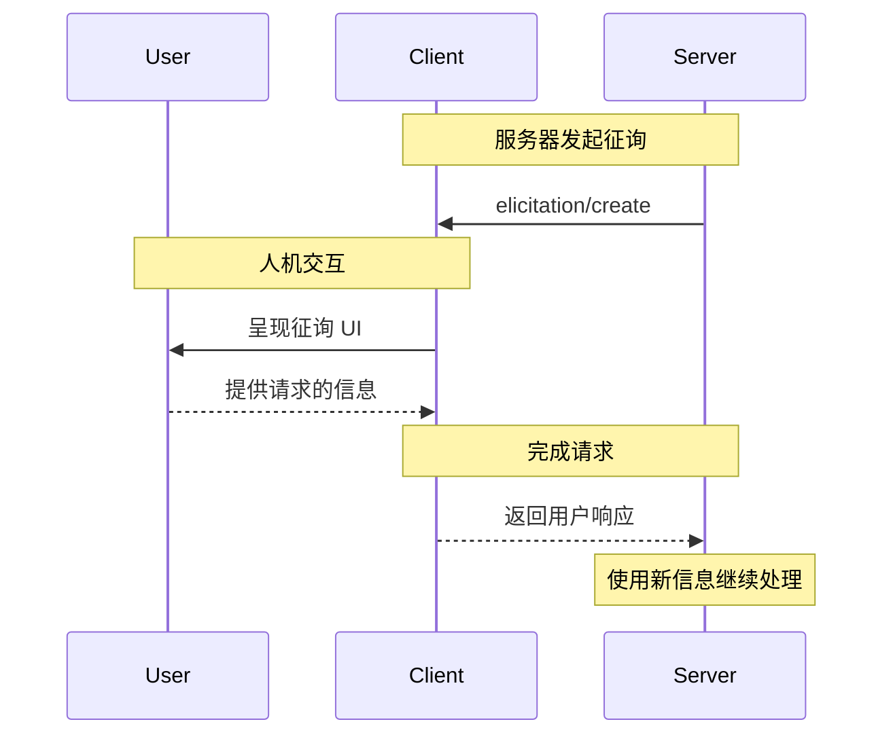
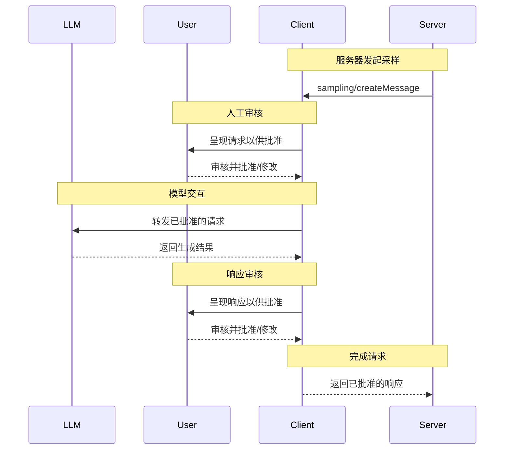

# MCP - Model Context Protocol

- Technical documentation
- Date: 2025-11-30

---

# 架构概述

本文档概述了模型上下文协议（MCP）的[范围](#范围)和[核心概念](#核心概念)，并提供了一个展示各核心概念的[示例](#示例)。

由于 MCP SDK 抽象了许多底层细节，大多数开发者可能会发现[数据层协议](#数据层协议)部分最为有用。该部分讨论了 MCP 服务器如何向 AI 应用程序提供上下文。

有关具体的实现细节，请参阅针对您所用[编程语言的 SDK 文档](https://modelcontextprotocol.io/docs/sdk)。

## 范围

模型上下文协议包含以下项目：

- [MCP 规范](https://modelcontextprotocol.io/specification/latest)：MCP 的规范文档，概述了客户端和服务器的实现要求。
- [MCP SDK](https://modelcontextprotocol.io/docs/sdk)：针对不同编程语言实现 MCP 的软件开发工具包。
- **MCP 开发工具**：用于开发 MCP 服务器和客户端的工具，包括 [MCP Inspector](https://github.com/modelcontextprotocol/inspector)
- [MCP 参考服务器实现](https://github.com/modelcontextprotocol/servers)：MCP 服务器的参考实现。

<p style='padding:10px;color:rgba(9, 93, 132, 1); border:1px solid rgba(14, 165, 233, .2) ; background-color: rgb(240 249 255 / .5);border-radius: 5px'>
  MCP 仅专注于上下文交换的协议——它不规定 AI 应用程序如何使用大语言模型或管理所提供的上下文。
</p>

## 核心概念

### 参与方

MCP 采用客户端-服务器架构，其中 MCP 宿主（host）——即像 [Claude Code](https://www.anthropic.com/claude-code) 或 [Claude Desktop](https://www.claude.ai/download) 这样的 AI 应用程序——会与一个或多个 MCP 服务器建立连接。MCP 宿主通过为每个 MCP 服务器创建一个 MCP 客户端来实现这一点。每个 MCP 客户端与其对应的 MCP 服务器维持专用的一对一连接。

MCP 架构中的关键参与方包括：

- **MCP 宿主（Host）**：协调和管理一个或多个 MCP 客户端的 AI 应用程序
- **MCP 客户端（Client）**：维持与 MCP 服务器连接的组件，从 MCP 服务器获取上下文供 MCP 宿主使用
- **MCP 服务器（Server）**：向 MCP 客户端提供上下文的程序

**例如**：Visual Studio Code 充当 MCP 宿主。当 Visual Studio Code 与 MCP 服务器（如 [Sentry MCP 服务器](https://docs.sentry.io/product/sentry-mcp/)）建立连接时，Visual Studio Code 运行时会实例化一个 MCP 客户端对象来维持与 Sentry MCP 服务器的连接。当 Visual Studio Code 随后连接到另一个 MCP 服务器（如[本地文件系统服务器](https://github.com/modelcontextprotocol/servers/tree/main/src/filesystem)）时，Visual Studio Code 运行时会实例化另一个 MCP 客户端对象来维持这个连接，因此保持了 MCP 客户端与 MCP 服务器之间的一对一关系。



请注意，**MCP 服务器**指的是提供上下文数据的程序，无论它在哪里运行。MCP 服务器可以在本地或远程执行。例如，当 Claude Desktop 启动[文件系统服务器](https://github.com/modelcontextprotocol/servers/tree/main/src/filesystem)时，该服务器在同一台机器上本地运行，因为它使用 STDIO 传输方式。这通常被称为"本地"MCP 服务器。官方的 [Sentry MCP 服务器](https://docs.sentry.io/product/sentry-mcp/)运行在 Sentry 平台上，并使用可流式 HTTP 传输。这通常被称为"远程"MCP 服务器。

### 层次

MCP 由两个层次组成：

- **数据层**：定义基于 JSON-RPC 的客户端-服务器通信协议，包括生命周期管理和核心原语，如工具、资源、提示和通知。
- **传输层**：定义实现客户端与服务器之间数据交换的通信机制和通道，包括特定于传输的连接建立、消息分帧和授权。

从概念上讲，数据层是内层，而传输层是外层。

#### 数据层

数据层实现了基于 [JSON-RPC 2.0](https://www.jsonrpc.org/) 的交换协议，该协议定义了消息结构和语义。该层包括：

- **生命周期管理**：处理客户端与服务器之间的连接初始化、能力协商和连接终止
- **服务器功能**：使服务器能够向客户端提供核心功能，包括用于 AI 操作的工具、用于上下文数据的资源，以及用于交互模板的提示
- **客户端功能**：使服务器能够请求客户端从宿主大语言模型进行采样、从用户获取输入，以及向客户端记录消息
- **实用功能**：支持额外的能力，如用于实时更新的通知和用于长时间运行操作的进度跟踪

#### 传输层

传输层管理客户端与服务器之间的通信通道和身份验证。它处理连接建立、消息分帧以及 MCP 参与方之间的安全通信。

MCP 支持两种传输机制：

- **Stdio 传输**：使用标准输入/输出流在同一台机器上的本地进程之间进行直接进程通信，提供最佳性能且无网络开销。
- **可流式 HTTP 传输**：使用 HTTP POST 进行客户端到服务器的消息传输，并可选地使用服务器发送事件（Server-Sent Events）实现流式传输能力。此传输方式支持远程服务器通信，并支持标准 HTTP 身份验证方法，包括 bearer token、API 密钥和自定义请求头。MCP 建议使用 OAuth 获取身份验证令牌。

传输层将通信细节从协议层中抽象出来，使所有传输机制都能使用相同的 JSON-RPC 2.0 消息格式。

### 数据层协议

MCP 的核心部分是定义 MCP 客户端与 MCP 服务器之间的模式和语义。开发者可能会发现数据层——特别是[原语](#primitives)集合——是 MCP 中最有趣的部分。它定义了开发者如何从 MCP 服务器向 MCP 客户端共享上下文的方式。

MCP 使用 [JSON-RPC 2.0](https://www.jsonrpc.org/) 作为其底层 RPC 协议。客户端和服务器相互发送请求并做出相应响应。当不需要响应时可以使用通知。

#### 生命周期管理

MCP 是一个<Tooltip tip="MCP 的一个子集可以使用可流式 HTTP 传输实现无状态">有状态协议</Tooltip>，需要生命周期管理。生命周期管理的目的是协商客户端和服务器都支持的<Tooltip tip="客户端或服务器支持的功能和操作，如工具、资源或提示">能力</Tooltip>。详细信息可以在[规范](/specification/2025-06-18/basic/lifecycle)中找到，[示例](#example)展示了初始化序列。

#### 原语

MCP 原语是 MCP 中最重要的概念。它们定义了客户端和服务器可以相互提供什么。这些原语指定了可以与 AI 应用程序共享的上下文信息类型以及可以执行的操作范围。

MCP 定义了*服务器*可以暴露的三个核心原语：

- **工具（Tools）**：AI 应用程序可以调用的可执行函数，用于执行操作（例如文件操作、API 调用、数据库查询）
- **资源（Resources）**：向 AI 应用程序提供上下文信息的数据源（例如文件内容、数据库记录、API 响应）
- **提示（Prompts）**：可重用的模板，帮助构建与大语言模型的交互（例如系统提示、少样本示例）

每种原语类型都有用于发现（`*/list`）、检索（`*/get`）以及在某些情况下执行（`tools/call`）的相关方法。MCP 客户端将使用 `*/list` 方法来发现可用的原语。例如，客户端可以首先列出所有可用工具（`tools/list`），然后执行它们。这种设计允许列表是动态的。

举个具体例子，考虑一个提供数据库上下文的 MCP 服务器。它可以暴露用于查询数据库的工具、包含数据库模式的资源，以及包含与工具交互的少样本示例的提示。

有关服务器原语的更多详细信息，请参阅[服务器概念](./server-concepts)。

MCP 还定义了*客户端*可以暴露的原语。这些原语允许 MCP 服务器作者构建更丰富的交互。

- **采样（Sampling）**：允许服务器从客户端的 AI 应用程序请求大语言模型补全。当服务器作者想要访问大语言模型，但希望保持模型独立性且不在其 MCP 服务器中包含大语言模型 SDK 时，这很有用。他们可以使用 `sampling/complete` 方法从客户端的 AI 应用程序请求大语言模型补全。
- **征询（Elicitation）**：允许服务器从用户请求额外信息。当服务器作者想要从用户获取更多信息或请求确认操作时，这很有用。他们可以使用 `elicitation/request` 方法从用户请求额外信息。
- **日志记录（Logging）**：使服务器能够向客户端发送日志消息，用于调试和监控目的。

有关客户端原语的更多详细信息，请参阅[客户端概念](./client-concepts)。

除了服务器和客户端原语之外，协议还提供了增强请求执行方式的跨领域实用原语：

- **任务（Tasks，实验性）**：持久执行包装器，支持对 MCP 请求进行延迟结果检索和状态跟踪（例如昂贵的计算、工作流自动化、批处理、多步骤操作）

#### 通知

协议支持实时通知，以实现服务器与客户端之间的动态更新。例如，当服务器的可用工具发生变化时——比如新功能可用或现有工具被修改——服务器可以发送工具更新通知，以告知连接的客户端这些变化。通知以 JSON-RPC 2.0 通知消息的形式发送（不期望响应），使 MCP 服务器能够向连接的客户端提供实时更新。

## 示例

### 数据层

本节提供了 MCP 客户端-服务器交互的分步演练，重点关注数据层协议。我们将使用 JSON-RPC 2.0 消息演示生命周期序列、工具操作和通知。

#### 1.初始化（生命周期管理）

MCP 从通过能力协商握手进行生命周期管理开始。如[生命周期管理](#生命周期管理)部分所述，客户端发送 `initialize` 请求以建立连接并协商支持的功能。

- **初始化请求**

```json
{
  "jsonrpc": "2.0",
  "id": 1,
  "method": "initialize",
  "params": {
    "protocolVersion": "2025-06-18",
    "capabilities": {
      "elicitation": {}
    },
    "clientInfo": {
      "name": "example-client",
      "version": "1.0.0"
    }
  }
}
```

- **初始化响应**

```json
{
  "jsonrpc": "2.0",
  "id": 1,
  "result": {
    "protocolVersion": "2025-06-18",
    "capabilities": {
      "tools": {
        "listChanged": true
      },
      "resources": {}
    },
    "serverInfo": {
      "name": "example-server",
      "version": "1.0.0"
    }
  }
}
```

##### 理解初始化交换

初始化过程是 MCP 生命周期管理的关键部分，具有以下几个重要目的：

1. **协议版本协商**：`protocolVersion` 字段（例如"2025-06-18"）确保客户端和服务器都使用兼容的协议版本。这可以防止不同版本尝试交互时可能发生的通信错误。如果无法协商出相互兼容的版本，则应终止连接。

2. **能力发现**：`capabilities` 对象允许双方声明它们支持的功能，包括它们可以处理哪些[原语](#primitives)（工具、资源、提示）以及它们是否支持[通知](#notifications)等功能。这通过避免不支持的操作来实现高效通信。

3. **身份交换**：`clientInfo` 和 `serverInfo` 对象提供用于调试和兼容性目的的识别和版本信息。

在此示例中，能力协商演示了如何声明 MCP 原语：

**客户端能力**：

- `"elicitation": {}` - 客户端声明它可以处理用户交互请求（可以接收 `elicitation/create` 方法调用）

**服务器能力**：

- `"tools": {"listChanged": true}` - 服务器支持工具原语，并且可以在其工具列表发生变化时发送 `tools/list_changed` 通知 \* `"resources": {}` - 服务器还支持资源原语（可以处理 `resources/list` 和 `resources/read` 方法）

初始化成功后，客户端发送通知表明它已准备就绪：

```json 通知 theme={null}
{
  "jsonrpc": "2.0",
  "method": "notifications/initialized"
}
```

##### 在 AI 应用程序中的工作原理

在初始化期间，AI 应用程序的 MCP 客户端管理器会与配置的服务器建立连接，并存储它们的能力以供后续使用。应用程序使用这些信息来确定哪些服务器可以提供特定类型的功能（工具、资源、提示）以及它们是否支持实时更新。

```python
# AI 应用程序初始化的伪代码
async with stdio_client(server_config) as (read, write):
    async with ClientSession(read, write) as session:
        init_response = await session.initialize()
              if init_response.capabilities.tools:
                  app.register_mcp_server(session, supports_tools=True)
              app.set_server_ready(session)
```

### 2.工具发现

现在连接已建立，客户端可以通过发送 `tools/list` 请求来发现可用工具。此请求是 MCP 工具发现机制的基础——它允许客户端在尝试使用工具之前了解服务器上有哪些可用工具。

- **工具列表请求**

```json
{
  "jsonrpc": "2.0",
  "id": 2,
  "method": "tools/list"
}
```

- **工具列表响应**

```json
{
  "jsonrpc": "2.0",
  "id": 2,
  "result": {
    "tools": [
      {
        "name": "calculator_arithmetic",
        "title": "计算器",
        "description": "执行数学计算，包括基本算术、三角函数和代数运算",
        "inputSchema": {
          "type": "object",
          "properties": {
            "expression": {
              "type": "string",
              "description": "要计算的数学表达式（例如 '2 + 3 * 4'、'sin(30)'、'sqrt(16)'）"
            }
          },
          "required": ["expression"]
        }
      },
      {
        "name": "weather_current",
        "title": "天气信息",
        "description": "获取全球任何地点的当前天气信息",
        "inputSchema": {
          "type": "object",
          "properties": {
            "location": {
              "type": "string",
              "description": "城市名称、地址或坐标（纬度,经度）"
            },
            "units": {
              "type": "string",
              "enum": ["metric", "imperial", "kelvin"],
              "description": "响应中使用的温度单位",
              "default": "metric"
            }
          },
          "required": ["location"]
        }
      }
    ]
  }
}
```

#### 理解工具发现请求

`tools/list` 请求很简单，不包含任何参数。

#### 理解工具发现响应

响应包含一个 `tools` 数组，该数组提供关于每个可用工具的完整元数据。这种基于数组的结构允许服务器同时暴露多个工具，同时在不同功能之间保持清晰的边界。

响应中的每个工具对象包含几个关键字段：

- **`name`**：服务器命名空间内工具的唯一标识符。这作为工具执行的主键，应遵循清晰的命名模式（例如 `calculator_arithmetic` 而不仅仅是 `calculate`）
- **`title`**：工具的人类可读显示名称，客户端可以向用户显示
- **`description`**：工具功能及使用时机的详细说明
- **`inputSchema`**：定义预期输入参数的 JSON Schema，支持类型验证并提供关于必需和可选参数的清晰文档

#### 在 AI 应用程序中的工作原理

AI 应用程序从所有连接的 MCP 服务器获取可用工具，并将它们组合成大语言模型可以访问的统一工具注册表。这使 LLM 能够了解它可以执行哪些操作，并在对话期间自动生成适当的工具调用。

```python
# 使用 MCP Python SDK 模式的伪代码
available_tools = []
for session in app.mcp_server_sessions():
    tools_response = await session.list_tools()
    available_tools.extend(tools_response.tools)
conversation.register_available_tools(available_tools)
```

### 3.工具执行

客户端现在可以使用 `tools/call` 方法执行工具。这展示了 MCP 原语在实践中的使用方式：在发现可用工具之后，客户端可以使用适当的参数调用它们。

#### 理解工具执行请求

`tools/call` 请求遵循结构化格式，以确保客户端和服务器之间的类型安全和清晰通信。请注意，我们使用的是发现响应中的正确工具名称（`weather_current`）而不是简化名称：

- **工具调用请求**

```json
{
  "jsonrpc": "2.0",
  "id": 3,
  "method": "tools/call",
  "params": {
    "name": "weather_current",
    "arguments": {
      "location": "San Francisco",
      "units": "imperial"
    }
  }
}
```

- **工具调用响应**

```json
{
  "jsonrpc": "2.0",
  "id": 3,
  "result": {
    "content": [
      {
        "type": "text",
        "text": "旧金山当前天气：68°F，部分多云，西风，风速 8 英里/小时。湿度：65%"
      }
    ]
  }
}
```

#### 理解工具执行请求

1. **`name`**：必须与发现响应中的工具名称（`weather_current`）完全匹配。这确保服务器可以正确识别要执行的工具。

2. **`arguments`**：包含由工具的 `inputSchema` 定义的输入参数。在此示例中：
   _ `location`："San Francisco"（必需参数）
   _ `units`："imperial"（可选参数，如果未指定则默认为"metric"）

3. **JSON-RPC 结构**：使用标准 JSON-RPC 2.0 格式，带有用于请求-响应关联的唯一 `id`。

#### 理解工具执行响应

1. **`content` 数组**：工具响应返回一个内容对象数组，允许丰富的多格式响应（文本、图像、资源等）

2. **内容类型**：每个内容对象都有一个 `type` 字段。在此示例中，`"type": "text"` 表示纯文本内容，但 MCP 支持各种内容类型以适应不同用例。

3. **结构化输出**：响应提供 AI 应用程序可用作与大语言模型交互上下文的可操作信息。

这种执行模式允许 AI 应用程序动态调用服务器功能，并接收可以集成到与大语言模型对话中的结构化响应。

#### 在 AI 应用程序中的工作原理

当大语言模型决定在对话期间使用工具时，AI 应用程序会拦截工具调用，将其路由到适当的 MCP 服务器，执行它，并将结果作为对话流的一部分返回给 LLM。这使 LLM 能够访问实时数据并在外部世界执行操作。

```python
# AI 应用程序工具执行的伪代码
async def handle_tool_call(conversation, tool_name, arguments):
    session = app.find_mcp_session_for_tool(tool_name)
    result = await session.call_tool(tool_name, arguments)
    conversation.add_tool_result(result.content)
```

### 4.实时更新（通知）

MCP 支持实时通知，使服务器能够在未被明确请求的情况下通知客户端有关变化的信息。这展示了通知系统，这是保持 MCP 连接同步和响应的关键功能。

#### 理解工具列表变化通知

当服务器的可用工具发生变化时——例如新功能可用、现有工具被修改或工具暂时不可用——服务器可以主动通知连接的客户端：

```json
{
  "jsonrpc": "2.0",
  "method": "notifications/tools/list_changed"
}
```

#### MCP 通知的关键特性

1. **无需响应**：请注意通知中没有 `id` 字段。这遵循 JSON-RPC 2.0 通知语义，其中不期望或发送响应。

2. **基于能力**：此通知仅由在初始化期间在其工具能力中声明了 `"listChanged": true` 的服务器发送（如步骤 1 所示）。

3. **事件驱动**：服务器根据内部状态变化决定何时发送通知，使 MCP 连接动态且响应迅速。

#### 客户端对通知的响应

收到此通知后，客户端通常会通过请求更新的工具列表来做出反应。这创建了一个刷新周期，使客户端对可用工具的理解保持最新：

```json
{
  "jsonrpc": "2.0",
  "id": 4,
  "method": "tools/list"
}
```

#### 通知的重要性

此通知系统之所以至关重要，有几个原因：

1. **动态环境**：工具可能会根据服务器状态、外部依赖项或用户权限而出现或消失
2. **效率**：客户端不需要轮询变化；它们会在更新发生时收到通知
3. **一致性**：确保客户端始终拥有关于可用服务器能力的准确信息
4. **实时协作**：支持可以适应变化上下文的响应式 AI 应用程序

这种通知模式扩展到除工具之外的其他 MCP 原语，实现客户端和服务器之间的全面实时同步。

#### 在 AI 应用程序中的工作原理

当 AI 应用程序收到有关工具变化的通知时，它会立即刷新其工具注册表并更新 LLM 的可用能力。这确保正在进行的对话始终可以访问最新的工具集，并且 LLM 可以在新功能可用时动态适应。

```python
# AI 应用程序通知处理的伪代码
async def handle_tools_changed_notification(session):
    tools_response = await session.list_tools()
    app.update_available_tools(session, tools_response.tools)
    if app.conversation.is_active():
        app.conversation.notify_llm_of_new_capabilities()
```

^架构概述-完结^

<br/>
<br/>

---

# 理解 MCP 服务器

MCP 服务器是一类程序，它们通过标准化的协议接口向 AI 应用暴露特定能力。

常见例子包括：用于文件访问的文件系统服务器、用于数据查询的数据库服务器、用于代码托管的 GitHub 服务器、用于团队沟通的 Slack 服务器，以及用于日程安排的日历服务器等。

## 服务器的核心功能

服务器通过三个基本构件向外提供能力：

|     Feature（特性）     | Explanation（解释）                                                                                                        | Examples（示例）                       | Who controls it（控制方） |
| :---------------------: | :------------------------------------------------------------------------------------------------------------------------- | -------------------------------------- | :-----------------------: |
|    **Tools（工具）**    | 模型可以主动调用的函数。模型会根据用户的请求自动决定是否调用它们。工具可以写数据库、调用外部 API、修改文件或触发任意逻辑。 | 搜索航班<br/>发送消息<br/>创建日历事件 |         **模型**          |
|  **Resources（资源）**  | 提供“只读”的数据源，用来给模型提供上下文。资源的内容可以来自文件、数据库、API 等。                                         | 获取文档<br/>访问知识库<br/>读取日历   |       **应用程序**        |
| **Prompts（提示模板）** | 预先写好的指令模板，引导模型如何使用特定工具和资源来完成任务。                                                             | 规划假期<br/>总结会议<br/>撰写邮件     |         **用户**          |

<br/>
以下我们用一个假设的场景来说明这三个功能如何协同工作。

## Tools（工具）

工具使 AI 模型能够执行操作。每个工具定义一个具有类型化输入和输出的特定操作。模型根据上下文请求来确定需要何时调用什么工具。

### 工具如何工作

工具是大语言模型可以调用的模式定义接口。MCP 使用 JSON Schema 进行验证。每个工具执行一个明确定义输入和输出的单一操作。工具可能需要在执行前获得用户同意，帮助确保用户对模型采取的操作保持控制。

**协议操作：**

| Method       | Purpose      | Returns                |
| ------------ | ------------ | ---------------------- |
| `tools/list` | 列出可用工具 | 带有模式的工具定义数组 |
| `tools/call` | 调用指定工具 | 工具执行结果           |

**示例工具定义：**

```typescript
{
  name: "searchFlights",
  description: "Search for available flights",
  inputSchema: {
    type: "object",
    properties: {
      origin: { type: "string", description: "Departure city" },
      destination: { type: "string", description: "Arrival city" },
      date: { type: "string", format: "date", description: "Travel date" }
    },
    required: ["origin", "destination", "date"]
  }
}
```

### 示例：旅行预订

工具让 AI 应用可以替用户完成具体操作。
在旅行规划场景中，应用可能会这样调用工具：

**航班搜索**

```
searchFlights(origin: "NYC", destination: "Barcelona", date: "2024-06-15")
```

查询多个航空公司并返回结构化航班结果。

**日历标记**

```
createCalendarEvent(title: "Barcelona Trip", startDate: "2024-06-15", endDate: "2024-06-22")
```

自动在用户日历上标注旅行日期。

**发送邮件**

```
sendEmail(to: "team@work.com", subject: "Out of Office", body: "...")
```

给同事发送“外出办公”邮件。

### 用户交互模型

工具由模型控制，这意味着 AI 模型可以自动发现和调用它们。但 MCP 通过一下几种机制强调人工监督控制。

- 在用户界面中展示所有可用工具，让用户自己选择哪些工具在这次会话中可用
- 每次调用工具时都弹出“执行确认窗口”
- 对安全的、无影响的工具可以提前授权
- 提供工具执行日志，让用户可以查看过去所有工具调用行为

## Resources（资源）

资源提供对信息的结构化访问，AI 应用程序可以检索这些信息并将其作为上下文提供给模型。

### 资源如何工作

资源可以来自文件、数据库、API 或 AI 需要理解上下文的其他任何来源的公开数据。应用程序可以自由决定如何处理这些资源，可以全文提供给模型，也可以使用关键词/Embedding 搜索后只提供相关部分。

每个资源具有唯一 URI（如 `file:///path/to/file.md`）和 MIME 类型，用于描述内容格式。

资源有两种发现方式：

- **直接资源（Direct Resources）**

  固定 URI 指向固定内容。例如：`calendar://events/2024` 返回 2024 全年的日历事件

- **资源模板（Resource Templates）**

  带参数的动态 URI，用于灵活查询。示例：
  `travel://activities/{city}/{category}` - 按城市和类别返回活动
  `travel://activities/barcelona/museums` - 返回巴塞罗那的所有博物馆

资源模板包含描述、标题、MIME 类型等元数据，便于系统发现和展示。

**协议操作：**

| Method                     | Purpose            | Returns          |
| -------------------------- | ------------------ | ---------------- |
| `resources/list`           | 列出可用的直接资源 | 资源描述数组     |
| `resources/templates/list` | 发现资源模板       | 模板定义数组     |
| `resources/read`           | 读取资源内容       | 资源数据及元信息 |
| `resources/subscribe`      | 订阅资源变更       | 订阅确认         |

### 示例：获取旅行规划上下文

在旅行例子中，资源可能包括：

- **用户日历**：`calendar://events/2024`
- **旅行文档**：`file:///Documents/Travel/passport.pdf`
- **历史行程**：`trips://history/barcelona-2023`

应用会先从这些资源中读取信息，比如过去喜欢什么酒店、今年有哪些空闲时间等，然后再把加工后的上下文输入给模型或不做处理直接将原始数据传递给模型，使模型能够根据这些上下文信息更好的处理用户的需求。

**资源模板示例**

```json
{
  "uriTemplate": "weather://forecast/{city}/{date}",
  "name": "weather-forecast",
  "title": "Weather Forecast",
  "description": "Get weather forecast for any city and date",
  "mimeType": "application/json"
}

{
  "uriTemplate": "travel://flights/{origin}/{destination}",
  "name": "flight-search",
  "title": "Flight Search",
  "description": "Search available flights between cities",
  "mimeType": "application/json"
}
```

这些模板支持灵活查询。对于天气数据，用户可以访问任何城市/日期组合的预报。对于航班，他们可以搜索任意两个机场之间的航线。当用户输入"NYC"作为 `origin` 机场并开始输入"Bar"作为 `destination` 机场时，系统可以建议"Barcelona (BCN)"或"Barbados (BGI)"。

### 参数补全（Parameter Completion）

动态资源支持智能补全：

- 在 `weather://forecast/{city}` 中输入"Par"可能会建议"Paris"或"Park City"
- 在 `flights://search/{airport}` 中输入"JFK"可能会建议"JFK - John F. Kennedy International"

系统帮助发现有效值，而无需了解确切的格式知识。

### 用户交互模型

资源由应用程序驱动，因此在检索、处理和呈现可用上下文方面具有灵活性。常见的交互模式包括：

- 类似“文件浏览器”的资源树
- 用于查找特定资源的搜索和筛选界面
- 基于启发式或 AI 选择的自动上下文包含或智能建议
- 用于包含单个或多个资源的手动或批量选择界面

协议不规定 UI 长什么样，开发者可以自由实现最适合自己产品的方式。

## 提示词（Prompt）

提示词是可复用的参数化指令模板，它们允许 MCP 服务器作者为某个领域提供参数化的提示词，或展示如何最好地使用 MCP 服务器。

### 提示模板如何工作

提示词是定义预期输入和交互模式的结构化模板。它们由用户控制，需要显式调用而不是自动触发或模型调用。提示词可以感知上下文，引用可用的资源和工具以创建全面的工作流程。与资源类似，提示词支持参数补全以帮助用户发现有效的参数值。

**协议操作：**

| Method         | Purpose          | Returns          |
| -------------- | ---------------- | ---------------- |
| `prompts/list` | 列出所有提示模板 | 提示模板描述数组 |
| `prompts/get`  | 读取提示模板详情 | 完整模板定义     |

### 示例：流程化工作

在旅行场景中，一个提示模板可能是：

**“计划一次假期” 提示模板：**

```json
{
  "name": "plan-vacation",
  "title": "Plan a vacation",
  "description": "Guide through vacation planning process",
  "arguments": [
    { "name": "destination", "type": "string", "required": true },
    { "name": "duration", "type": "number", "description": "days" },
    { "name": "budget", "type": "number", "required": false },
    { "name": "interests", "type": "array", "items": { "type": "string" } }
  ]
}
```

使用方式：

1. 选择“Plan a vacation”提示模板
2. 输入结构化参数：Barcelona， 7 天，3000 美元，["beaches", "architecture", "food"]
3. 模型根据模板流程执行任务，全程一致、稳定

### 用户交互模型

提示词由用户控制，需要显式调用。协议为实现者提供了在其应用程序中设计自然感觉界面的自由。关键原则包括：

- 轻松发现可用提示词
- 清楚描述每个提示词的作用
- 带有验证的自然参数输入
- 透明显示提示词的底层模板

应用程序通常通过各种 UI 模式公开提示词，例如：

- 斜杠命令（输入"/"查看可用提示词，如 /plan-vacation）
- 可搜索访问的命令面板
- 用于常用提示词的专用 UI 按钮
- 建议相关提示词的上下文菜单

目标是让用户容易发现、容易理解、容易使用。

## 将多个服务器组合起来

MCP 的强大之处在于它可以让多个服务器的能力协同工作，统一管理。

### 示例：多服务器旅行规划

假设应用连接了三个服务器：

- **Travel Server**：负责航班、酒店、行程
- **Weather Server**：负责天气和气候
- **Calendar/Email Server**：负责日历和邮件

### 完整流程示例

**1. 用户调用提示模板并填写参数：**

```json
{
  "prompt": "plan-vacation",
  "arguments": {
    "destination": "Barcelona",
    "departure_date": "2024-06-15",
    "return_date": "2024-06-22",
    "budget": 3000,
    "travelers": 2
  }
}
```

**2. 用户选择要包含的资源：**

- `calendar://my-calendar/June-2024`
- `travel://preferences/europe`
- `travel://past-trips/Spain-2023`

**3. AI 使用工具执行任务：**

它先读取所有资源，理解：

- 用户的空闲时间
- 旅行偏好
- 过去喜欢的活动

然后执行工具：

- `searchFlights()` → 查航班
- `checkWeather()` → 查天气
- `bookHotel()` → 找酒店
- `createCalendarEvent()` → 添加日程
- `sendEmail()` → 发送确认邮件

整个过程跨多个服务器同步进行，并在需要时询问用户确认。

#### 最终效果

用户只需调用“Plan a vacation”提示模板 + 提供一些资源，
AI 就能自动整合多个 MCP 服务器的能力：

- 从 Calendar Server 获取日程
- 从 Travel Server 找偏好与历史
- 从 Weather Server 查天气
- 调用工具完成航班、酒店预订与日历更新

原本要花几个小时的操作，只需几分钟即可完成。

^服务端-完结^

<br/>
<br/>

---

# 理解 MCP 客户端

MCP 客户端由宿主应用程序实例化，用于与特定的 MCP 服务器通信。宿主应用程序（如 Claude.ai 或 IDE）管理整体用户体验并协调多个客户端。每个客户端处理与一个服务器的直接通信。

理解这一区别很重要：*宿主*是用户交互的应用程序，而*客户端*是支持服务器连接的协议级组件。

## 核心客户端功能

除了利用服务器提供的上下文之外，客户端还可以向服务器提供多种功能。这些客户端功能允许服务器作者构建更丰富的交互。

| 功能                    | 说明                                                                                                         | 示例                                                                                 |
| ----------------------- | ------------------------------------------------------------------------------------------------------------ | ------------------------------------------------------------------------------------ |
| **征询（Elicitation）** | 征询使服务器能够在交互期间向用户请求特定信息，为服务器按需收集信息提供结构化方式。                           | 预订旅行的服务器可能会询问用户对飞机座位、房间类型的偏好或他们的联系电话以完成预订。 |
| **根目录（Roots）**     | 根目录允许客户端指定服务器应关注哪些目录，通过协调机制传达预期范围。                                         | 预订旅行的服务器可能会被授予访问特定目录的权限，从中可以读取用户的日历。             |
| **采样（Sampling）**    | 采样允许服务器通过客户端请求大语言模型补全，实现智能体工作流程。这种方法使客户端完全控制用户权限和安全措施。 | 预订旅行的服务器可能会向大语言模型发送航班列表，并请求大语言模型为用户选择最佳航班。 |

### 征询（Elicitation）

征询使服务器能够在交互期间向用户请求特定信息，创建更加动态和响应式的工作流程。

#### 概述

征询提供了一种结构化的方式，供服务器按需收集必要信息。服务器无需预先要求所有信息或在数据缺失时失败，而是可以暂停操作以向用户请求特定输入。这创建了更灵活的交互，其中服务器适应用户需求，而不是遵循僵化的模式。

**征询流程：**



该流程支持动态信息收集。服务器可以在需要时请求特定数据，用户通过适当的 UI 提供信息，服务器使用新获取的上下文继续处理。

**征询组件示例：**

```typescript theme={null}
{
  method: "elicitation/requestInput",
  params: {
    message: "请确认您的巴塞罗那假期预订详情：",
    schema: {
      type: "object",
      properties: {
        confirmBooking: {
          type: "boolean",
          description: "确认预订（航班 + 酒店 = $3,000）"
        },
        seatPreference: {
          type: "string",
          enum: ["靠窗", "靠走廊", "无偏好"],
          description: "航班首选座位类型"
        },
        roomType: {
          type: "string",
          enum: ["海景", "城景", "园景"],
          description: "酒店首选房间类型"
        },
        travelInsurance: {
          type: "boolean",
          default: false,
          description: "添加旅行保险（$150）"
        }
      },
      required: ["confirmBooking"]
    }
  }
}
```

#### 示例：假期预订确认

旅行预订服务器通过最终预订确认流程展示了征询的威力。当用户选择了前往巴塞罗那的理想度假套餐时，服务器需要在继续之前收集最终批准和任何缺失的详细信息。

服务器通过结构化请求征询预订确认，该请求包括旅行摘要（巴塞罗那航班 6 月 15-22 日，海滨酒店，总计 $3,000）以及任何其他偏好字段——例如座位选择、房间类型或旅行保险选项。

随着预订的进行，服务器征询完成预订所需的联系信息。它可能会询问航班预订的旅客详情、酒店的特殊要求或紧急联系信息。

#### 用户交互模型

征询交互旨在清晰、符合上下文且尊重用户自主权：

**请求呈现**：客户端显示征询请求，并明确说明是哪个服务器在请求、为什么需要该信息以及将如何使用。请求消息解释目的，而模式提供结构和验证。

**响应选项**：用户可以通过适当的 UI 控件（文本字段、下拉菜单、复选框）提供请求的信息，拒绝提供信息并可选择说明原因，或取消整个操作。客户端在将响应返回给服务器之前，会根据提供的模式验证响应。

**隐私考虑**：征询从不请求密码或 API 密钥。客户端会对可疑请求发出警告，并让用户在发送之前查看数据。

### 根目录（Roots）

根目录为服务器操作定义文件系统边界，允许客户端指定服务器应关注哪些目录。

#### 概述

根目录是客户端向服务器传达文件系统访问边界的机制。它们由文件 URI 组成，指示服务器可以操作的目录，帮助服务器理解可用文件和文件夹的范围。虽然根目录传达预期边界，但它们不强制执行安全限制。实际的安全性必须在操作系统级别通过文件权限和/或沙箱来强制执行。

**根目录结构：**

```json theme={null}
{
  "uri": "file:///Users/agent/travel-planning",
  "name": "旅行规划工作空间"
}
```

根目录专门用于文件系统路径，并始终使用 `file://` URI 方案。它们帮助服务器理解项目边界、工作空间组织和可访问目录。根目录列表可以随着用户处理不同项目或文件夹而动态更新，当边界更改时，服务器通过 `roots/list_changed` 接收通知。

#### 示例：旅行规划工作空间

处理多个客户旅行的旅行代理受益于根目录来组织文件系统访问。考虑一个包含旅行规划各个方面的不同目录的工作空间。

客户端向旅行规划服务器提供文件系统根目录：

- `file:///Users/agent/travel-planning` - 包含所有旅行文件的主工作空间
- `file:///Users/agent/travel-templates` - 可重用的行程模板和资源
- `file:///Users/agent/client-documents` - 客户护照和旅行文档

当代理创建巴塞罗那行程时，表现良好的服务器会尊重这些边界——访问模板、保存新行程并引用指定根目录内的客户文档。服务器通常通过使用根目录的相对路径或利用尊重根目录边界的文件搜索工具来访问根目录内的文件。

如果代理打开像 `file:///Users/agent/archive/2023-trips` 这样的存档文件夹，客户端会通过 `roots/list_changed` 更新根目录列表。

有关尊重根目录的服务器的完整实现，请参阅官方服务器存储库中的[文件系统服务器](https://github.com/modelcontextprotocol/servers/tree/main/src/filesystem)。

#### 设计理念

根目录作为客户端和服务器之间的协调机制，而不是安全边界。规范要求服务器"应该（SHOULD）尊重根目录边界"，而不是"必须（MUST）强制执行"它们，因为服务器运行客户端无法控制的代码。

根目录在以下情况下效果最佳：服务器受信任或经过审查，用户理解其建议性质，目标是防止意外而不是阻止恶意行为。它们擅长于上下文范围界定（告诉服务器关注哪里）、意外预防（帮助表现良好的服务器保持在边界内）以及工作流程组织（例如自动管理项目边界）。

#### 用户交互模型

根目录通常由宿主应用程序根据用户操作自动管理，尽管某些应用程序可能会公开手动根目录管理：

**自动根目录检测**：当用户打开文件夹时，客户端会自动将其公开为根目录。打开旅行工作空间允许客户端将该目录公开为根目录，帮助服务器理解哪些行程和文档在当前工作范围内。

**手动根目录配置**：高级用户可以通过配置指定根目录。例如，添加 `/travel-templates` 用于可重用资源，同时排除包含财务记录的目录。

### 采样（Sampling）

采样允许服务器通过客户端请求语言模型补全，在保持安全性和用户控制的同时实现智能体行为。

#### 概述

采样使服务器能够在不直接集成或支付 AI 模型费用的情况下执行依赖 AI 的任务。相反，服务器可以请求已经拥有 AI 模型访问权限的客户端代表它们处理这些任务。这种方法使客户端完全控制用户权限和安全措施。因为采样请求发生在其他操作（如分析数据的工具）的上下文中，并作为单独的模型调用处理，它们在不同上下文之间保持清晰的边界，从而更有效地使用上下文窗口。

**采样流程：**



该流程通过多个人工审核检查点确保安全性。用户在初始请求和生成的响应返回服务器之前都可以审核并修改。

**请求参数示例：**

```typescript theme={null}
{
  messages: [
    {
      role: "user",
      content: "分析这些航班选项并推荐最佳选择：\n" +
               "[47 个航班，包含价格、时间、航空公司和中转]\n" +
               "用户偏好：早晨出发，最多 1 次中转"
    }
  ],
  modelPreferences: {
    hints: [{
      name: "claude-sonnet-4-20250514"  // 建议的模型
    }],
    costPriority: 0.3,      // 对 API 成本不太关心
    speedPriority: 0.2,     // 可以等待彻底分析
    intelligencePriority: 0.9  // 需要复杂的权衡评估
  },
  systemPrompt: "您是一位旅行专家，帮助用户根据他们的偏好找到最佳航班",
  maxTokens: 1500
}
```

#### 示例：航班分析工具

考虑一个具有名为 `findBestFlight` 的工具的旅行预订服务器，该工具使用采样来分析可用航班并推荐最佳选择。当用户询问"为我预订下个月去巴塞罗那的最佳航班"时，该工具需要 AI 帮助来评估复杂的权衡。

该工具查询航空公司 API 并收集 47 个航班选项。然后它请求 AI 帮助分析这些选项："分析这些航班选项并推荐最佳选择：[47 个航班，包含价格、时间、航空公司和中转] 用户偏好：早晨出发，最多 1 次中转。"

客户端发起采样请求，允许 AI 评估权衡——例如更便宜的红眼航班与方便的早晨出发航班。该工具使用此分析呈现前三个推荐。

#### 用户交互模型

虽然不是必需的，但采样设计为允许人工审核控制。用户可以通过多种机制保持监督：

**批准控制**：采样请求可能需要明确的用户同意。客户端可以显示服务器想要分析什么以及原因。用户可以批准、拒绝或修改请求。

**透明度功能**：客户端可以显示确切的提示词、模型选择和令牌限制，允许用户在 AI 响应返回服务器之前进行审核。

**配置选项**：用户可以设置模型偏好，为受信任的操作配置自动批准，或要求批准所有内容。客户端可以提供编辑敏感信息的选项。

**安全考虑**：客户端和服务器在采样期间都必须适当处理敏感数据。客户端应实施速率限制并验证所有消息内容。人工审核设计确保服务器发起的 AI 交互不会在没有明确用户同意的情况下危及安全性或访问敏感数据。

---
